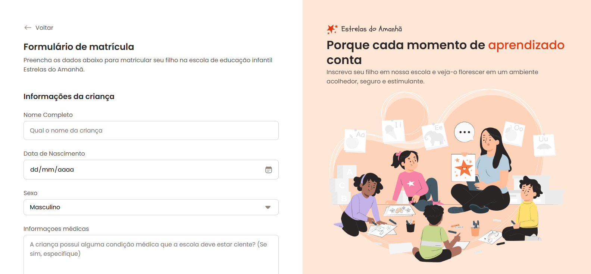

# Formulário de Matrícula



Este projeto é um formulário de matrícula simples, desenvolvido com foco em HTML e CSS. Ele demonstra a criação de interfaces de usuário responsivas e acessíveis, utilizando as melhores práticas de desenvolvimento web.

## Habilidades em HTML

Durante o desenvolvimento deste formulário, as seguintes habilidades em HTML foram aplicadas:

*   **Estrutura Semântica:** Utilização de tags HTML5 semânticas como `<header>`, `<section>`, `<aside>`, `<form>`, `<fieldset>`, `<legend>`, `<label>`, `<input>`, `<select>`, `<textarea>` para garantir uma estrutura clara e significativa do conteúdo, melhorando a acessibilidade e o SEO.
*   **Formulários Acessíveis:** Implementação de elementos de formulário com atributos `for` e `id` para associar rótulos (`<label>`) aos campos de entrada, o que é crucial para a acessibilidade, especialmente para usuários de leitores de tela.
*   **Tipos de Input Específicos:** Uso de diferentes tipos de `input` como `text`, `date` e `email` para coletar informações variadas, e `select` para opções pré-definidas, garantindo a validação básica e a experiência do usuário.
*   **Integração de Ícones SVG:** Utilização de elementos `<svg>` diretamente no HTML para renderizar ícones escaláveis e de alta qualidade, como o ícone de 'voltar', demonstrando controle sobre gráficos vetoriais e otimização de recursos.
*   **Elementos Interativos:** Inclusão de elementos como `img` para ilustrações, demonstrando a capacidade de integrar diferentes tipos de mídia.

## Habilidades em CSS

As seguintes habilidades em CSS foram demonstradas para estilizar e tornar o formulário responsivo:

*   **Validação de E-mail com CSS:** Implementação de validação visual para campos de e-mail, exibindo avisos quando o formato está incorreto ou o campo não foi preenchido, utilizando pseudo-classes CSS como `:invalid` e seletores de adjacência para estilizar mensagens de erro sem a necessidade de JavaScript.
*   **CSS Reset e Box-Sizing:** Aplicação de um reset básico (`margin: 0; padding: 0; box-sizing: border-box;`) para garantir consistência de estilo entre diferentes navegadores e um controle preciso do layout.
*   **Variáveis CSS (Custom Properties):** Definição e uso de variáveis CSS para gerenciar cores, tamanhos de fonte e outros valores repetitivos, facilitando a manutenção e a criação de temas (`--text-primary`, `--brand-light`, etc.).
*   **Layout com Grid CSS:** Utilização de `display: grid` para criar layouts complexos e responsivos, como a divisão da página em duas colunas (`grid-template-columns: 51.25% 48.75%`) e o posicionamento de elementos dentro do grid (`grid-area`). A propriedade `min-height: 100vh;` no elemento `#app` garante que o layout ocupe a altura total da viewport, essencial para uma experiência de usuário consistente.
*   **Posicionamento Fixo:** O uso de `position: fixed;` para elementos como o `aside-container` demonstra a capacidade de criar componentes que permanecem visíveis na tela, independentemente da rolagem, melhorando a navegação ou a apresentação de informações importantes.
*   **Flexbox para Alinhamento:** Emprego de `display: flex` para alinhar e distribuir itens dentro de contêineres, como no cabeçalho e nos wrappers de input (`.flex`, `.flex-column`, `gap`).
*   **Estilização de Formulários:** Customização de elementos de formulário padrão (`input`, `select`, `textarea`) para um design coeso e agradável, incluindo bordas, padding, cores e estados de foco.
*   **Design Responsivo:** Aplicação de técnicas de design responsivo para garantir que o formulário se adapte a diferentes tamanhos de tela, proporcionando uma boa experiência em dispositivos móveis e desktops.
*   **Classes de Utilidade:** Criação de classes CSS de utilidade (`.bg-brand-light`, `.text-primary`, `.m-bottom-24`, etc.) para estilos reutilizáveis, promovendo a modularidade e a agilidade no desenvolvimento.
*   **Importação de Fontes:** Integração de fontes externas (Google Fonts - Poppins) para uma tipografia personalizada e profissional.

## Como Rodar o Projeto

Para visualizar o projeto localmente, siga os passos abaixo:

1.  Clone o repositório:
    ```bash
    git clone https://github.com/luanfiszer/formulario-matricula.git
    ```
2.  Navegue até o diretório do projeto:
    ```bash
    cd formulario-matricula
    ```
3.  Abra o arquivo `index.html` em seu navegador preferido.

## Contribuição

Contribuições são bem-venidas! Sinta-se à vontade para abrir issues ou pull requests.

## Licença

Este projeto está licenciado sob a licença MIT. Veja o arquivo `LICENSE` para mais detalhes.


